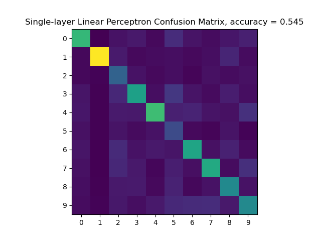
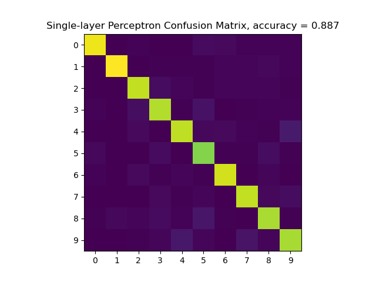
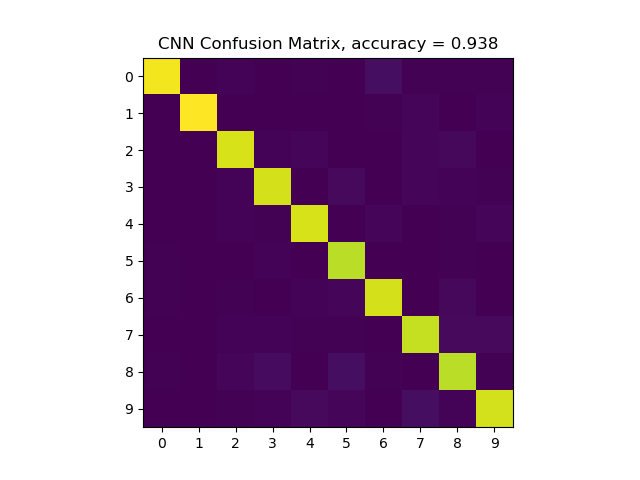

# Handwritten Digit Classification — Neural Networks From Scratch

This project implements multiple neural-network architectures **entirely from scratch in NumPy** to classify handwritten digits from a reduced MNIST dataset (14×14 grayscale images). All forward passes, backward passes, loss functions, layers, and optimizers are manually coded following the chain rule and standard deep-learning math.

The repository contains code for **four models**, a **training pipeline**, and a flexible **main driver** that lets users easily run or test any architecture.

---

## What This Project Does

### **1. Loads the reduced MNIST dataset**
- Inputs are 196-dim vectors (14×14 images flattened)
- Labels are integers `0–9`
- Everything is manually normalized and batched

### **2. Trains neural networks with mini-batch SGD**
Includes:
- Shuffled mini-batch generator  
- Forward functions for all layers  
- Backpropagation functions  
- Manual parameter updates  

### **3. Implements four different models**

#### ** Single-Layer Perceptron (SLP-Linear)**
- One FC layer  
- Euclidean loss  
- No softmax  

#### ** Single-Layer Perceptron with Softmax (SLP)**
- Linear layer  
- Softmax + cross-entropy loss  

#### ** Multi-Layer Perceptron (MLP)**
- `FC -> ReLU -> FC -> Softmax`

#### ** Convolutional Neural Network (CNN)**
- Convolution  
- 2×2 Max Pooling  
- Flatten  
- FC classifier  

---

## Key Components in `p4.py`

### **Utility**
- `get_mini_batch` — batching + one-hot encoding

### **Layers**
- `fc`, `fc_backward`
- `relu`, `relu_backward`
- `conv`, `conv_backward`
- `pool2x2`, `pool2x2_backward`
- `flattening`, `flattening_backward`

### **Loss Functions**
- `loss_euclidean`
- `loss_cross_entropy_softmax`

### **Training Functions**
- `train_slp_linear`
- `train_slp`
- `train_mlp`
- `train_cnn`

---

## `main_functions.py` — Experiment Runner

Defines:
- `main_slp_linear`
- `main_slp`
- `main_mlp`
- `main_cnn`

Each:
1. Loads dataset  
2. Normalizes images  
3. Loads saved weights **or** trains from scratch  
4. Computes predictions  
5. Plots confusion matrix  
6. Saves `.npz` parameter files  

---

## Customizing Experiments

Your `if __name__ == "__main__"` block acts as a control panel.

Example:

```python
if __name__ == "__main__":
    main_slp_linear(dataset_dir="./ReducedMNIST/", load_weights=True)
    # main_slp(dataset_dir="./ReducedMNIST/", load_weights=False)
    # main_mlp(dataset_dir="./ReducedMNIST/", load_weights=False)
    # main_cnn(dataset_dir="./ReducedMNIST/", load_weights=False)
```

### **To retrain a model:**  
Set `load_weights=False`.

### **To evaluate using saved weights:**  
Set `load_weights=True`.

### **To try different models:**  
Uncomment the one you want, or flip **True -> False**.

---

## Outputs

Each run produces:
- Train accuracy  
- Test accuracy  
- Confusion matrix  
- Saved weights (`.npz` files)  

Here is a set of examples from each trained architecture:

SLP Linear


SLP


MLP


CNN


---

## Summary

This project builds modern neural networks **without PyTorch or TensorFlow**—every layer, gradient computation, and training update is implemented manually for clarity and educational value. Users can easily experiment by modifying the flags in the `__main__` block.